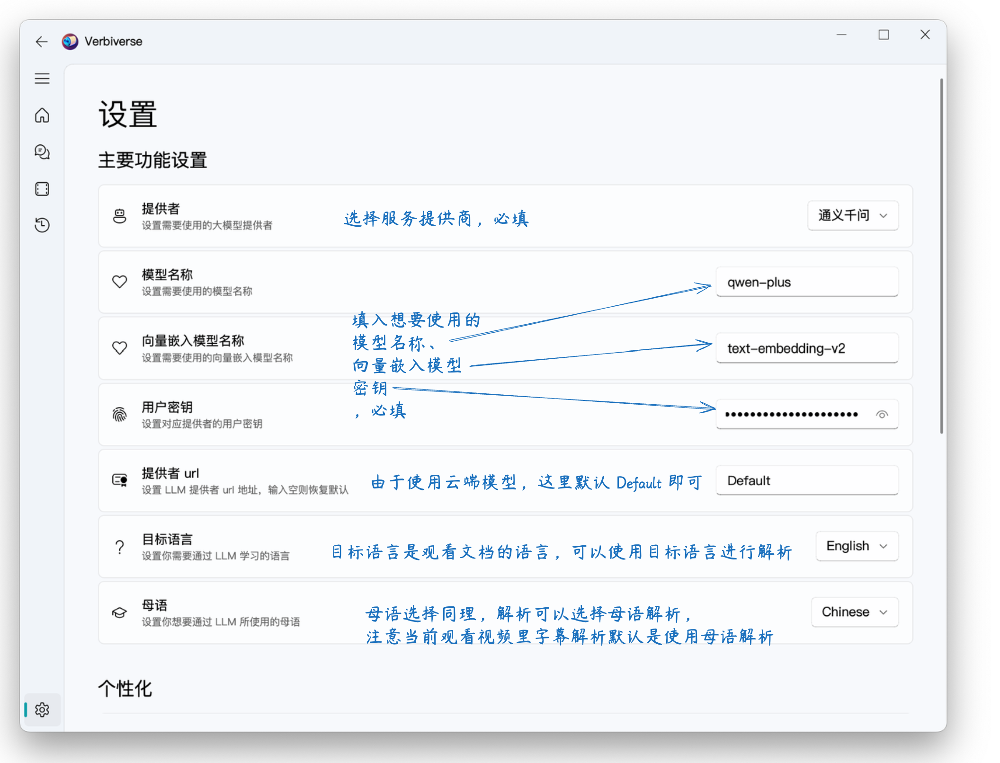
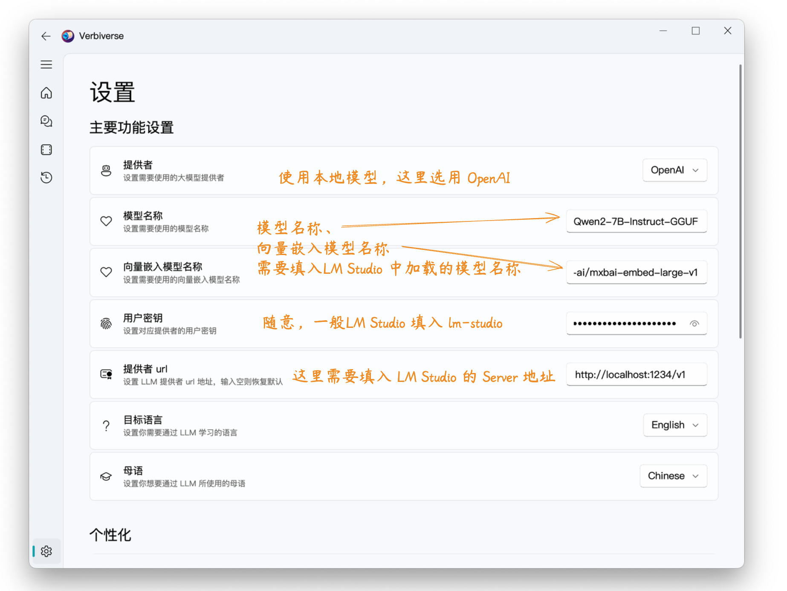

# Verbiverse

**Verbiverse** 利用 LLM 大模型辅助阅读 PDF 与观看视频，用以提升语言能力。

<!-- PROJECT SHIELDS -->

[![Contributors][contributors-shield]][contributors-url]
[![Forks][forks-shield]][forks-url]
[![Stargazers][stars-shield]][stars-url]
[![Issues][issues-shield]][issues-url]
[![MIT License][license-shield]][license-url]

<!-- PROJECT LOGO -->
 

  

  <h3 align="center">利用大模型辅助阅读</h3>
  

    通过预定义的 Prompt 更加方便、快捷的使用大模型，专为想要提升语言能力的你所设计。
     
    <a href="https://github.com/HATTER-LONG/Verbiverse#目录"><strong>探索本项目的文档 »</strong></a>
     
     
    <a href="https://github.com/HATTER-LONG/Verbiverse#上手指南">上手指南</a>
    ·
    <a href="https://github.com/HATTER-LONG/Verbiverse/issues">报告Bug</a>
    ·
    <a href="https://github.com/HATTER-LONG/Verbiverse/issues">提出新特性</a>
  

## 功能介绍

`Verbiverse` 可以针对阅读外语 PDF 或观看视频时的外语字幕，对不理解的单词、语句结合上下文进行解析，对比词典的生硬翻译、多义词模糊不清的情况有更好的体验：

1. 主页界面如下，左侧为导航栏跳转至不同功能页面，主页面整体分为 PDF或视频文件入口与历史文件列表两个部分，点击对应的按钮选择对应文件即可：

   

2. 主页点击`阅读 PDF` 打开想要阅读的文档后，工具会自动跳转如下界面，左侧为阅读区、右侧为 LLM 对话区，当选中陌生词汇后鼠标右键可以通过 LLM 进行解析：
   
   
   

3. 主页点击`观看视频`选择视频文件后，工具会自动跳转视频播放界面，左侧分为视频播放区、字幕，右侧则是是字幕列表与同文件夹下的其他媒体文件：

   - 工具会自动加载同目录下同名但以 `srt` 结尾的字幕文件，如果字幕文件无法自动加载可以鼠标右键手动选择添加；
   - 双击字幕中的单词会对单个词进行解析，点击右侧的图标则是对当前字幕语句进行解析：

     
     

4. 单词本当前没有什么特殊功能，仅仅用于收集作用，有什么好的建议欢迎提出：
   

## 上手指南

### 预编译包

提供如下平台预编译程序包，下载对应平台程序包执行即可：

- [Windows x86_64](https://github.com/HATTER-LONG/Verbiverse/releases/latest)
- [ubuntu_22.04 x86_64](https://github.com/HATTER-LONG/Verbiverse/releases/latest)

### 源码运行

1. clone 源码到本地：`git clone https://github.com/HATTER-LONG/Verbiverse.git`
2. 使用conda 或 python (>=3.9, <=3.12) venv 创建虚拟环境，推荐使用 conda：
   - 使用 conda：`conda create -n Verbiverse python=3.11; conda activate Verbiverse`;
   - 使用 venv，进入源码目录后：`python3 -m venv ./.venv;source ./venv/bin/activate`;
3. 安装 poetry：
   - 确认已正确启用虚拟环境；
   - `pip install -U pip setuptools;pip install poetry`;
4. 安装项目依赖环境：`poetry install`：
   - 需要代理则取消 `pyproject.toml` 中 `[[tool.poetry.source]]` 相关注释;
5. 运行程序：`python3 main.py`

### 工具设置

> ⚠️强烈建议优先使用本地模型或较小的 PDF 文档进行试用，因为工具很多的 prompt 与向量嵌入并没有对 token 进行优化，过大的文件可能会造成大量 token 消耗！！！！

工具的核心功能依赖 LLM，因此在使用前需要配置相应 LLM 的服务信息，工具支持使用本地模型或云端商用模型，当前支持 OpenAI 协议本地工具或商用模型与通义千问商用模型：

1. 使用商用模型，下图以通义千问为例，如需使用 OpenAI 同理填入对应信息即可：
   

2. 使用本地模型，需要选择 OpenAI 协议，填入本地工具的 LLM 服务地址，使用 LM Studio 为例：
   - LM Studio 安装对应模型：
     
   - 工具配置：
     

## 鸣谢

感谢如下相关开源项目：

- [PyQt-Fluent-Widgets](https://github.com/zhiyiYo/PyQt-Fluent-Widgets)
- [langchain-ai](https://github.com/langchain-ai/langchain)
- [pdf.js](https://github.com/mozilla/pdf.js)
- [DashPlayer](https://github.com/solidSpoon/DashPlayer)

<!-- links -->

[your-project-path]: HATTER-LONG/Verbiverse
[contributors-shield]: https://img.shields.io/github/contributors/HATTER-LONG/Verbiverse.svg?style=flat-square
[contributors-url]: https://github.com/HATTER-LONG/Verbiverse/graphs/contributors
[forks-shield]: https://img.shields.io/github/forks/HATTER-LONG/Verbiverse.svg?style=flat-square
[forks-url]: https://github.com/HATTER-LONG/Verbiverse/network/members
[stars-shield]: https://img.shields.io/github/stars/HATTER-LONG/Verbiverse.svg?style=flat-square
[stars-url]: https://github.com/HATTER-LONG/Verbiverse/stargazers
[issues-shield]: https://img.shields.io/github/issues/HATTER-LONG/Verbiverse.svg?style=flat-square
[issues-url]: https://img.shields.io/github/issues/HATTER-LONG/Verbiverse.svg
[license-shield]: https://img.shields.io/github/license/HATTER-LONG/Verbiverse.svg?style=flat-square
[license-url]: https://github.com/HATTER-LONG/Verbiverse/blob/main/LICENSE
